## Как начать делать лабы по АЯ. Windows.

### Введение.
Данный туториал написан для студентов МГТУ им Н. Э. Баумана и в частности для ИУ8 ради облегчения их нелёгкого пути ~~по морям дискретной математики~~ в лабораторных работах по Алгоритмическим языкам.

Перед тем, как мы начнём, хочу вас в последний раз предостеречь от выполнения лаб
под виндой. Линукс - то, с чем вам всё равно придётся подружиться рано или поздно.
И поверьте, на примере как своём, так и многих-многих тех, кто пытался что-то мудрить
со своей лицензионной виндушечкой, которая шла вместе с ноутом, а потому было слишком 
тяжело с ней расставаться. Для таких моментов существует такая вещь как установка двух ОС
рядом, при таком раскладе вы просто выбираете нужную вам операционку при старте загрузчика grub:


В последний раз прошу вас рассмотреть этот вариант и не идти дальше и посмотреть в
сторону того же [Ubuntu](https://ubuntu.com/download)(годный дистрибутив для начинающих в линукс).

## План действий.
 - **Установка CLion.**
 - **Установка Github Desktop.**
 - **CLion. Начало работы.**
 - **Немного о сдаче лаб.**
 
### Как установить CLion и настроить Gtest

Последняя команда может быть необязательной для выполнения каждый раз, но если что-то не работает, то её нужно выполнить.

* Подать заявку на предоставление бесплатной лицензии [JetBrains Products for Learning](https://www.jetbrains.com/shop/eform/students)

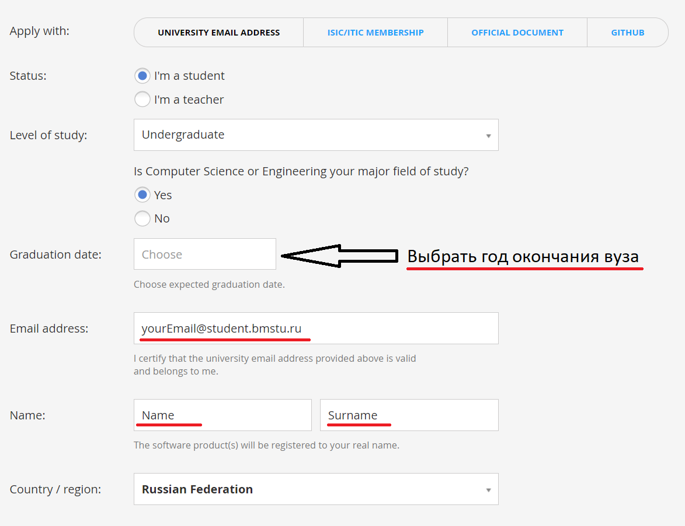

(То, что подчёркнуто красным нужно заполнить)

* Скачать [CLion](https://www.jetbrains.com/clion/)

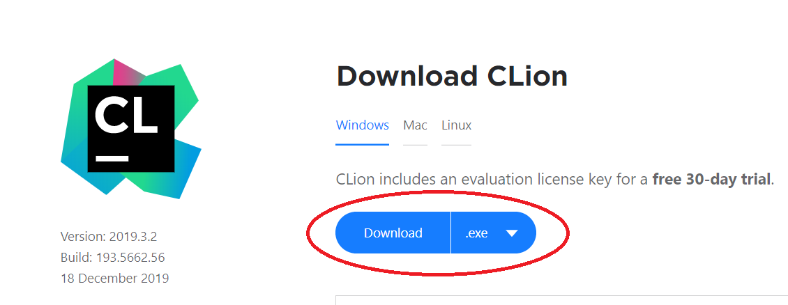

* Установить CLion. 

Установка стандартная, ничего дополнительно нажимать не требуется(только при желании это сделать)

* Активировать CLion, используя университетскую почту
(P.S. если вы её до сих пор не получили, получите в ГЗ в 91 кабинете)

* Далее нужно скачать [Python](https://www.python.org/downloads/) 
 
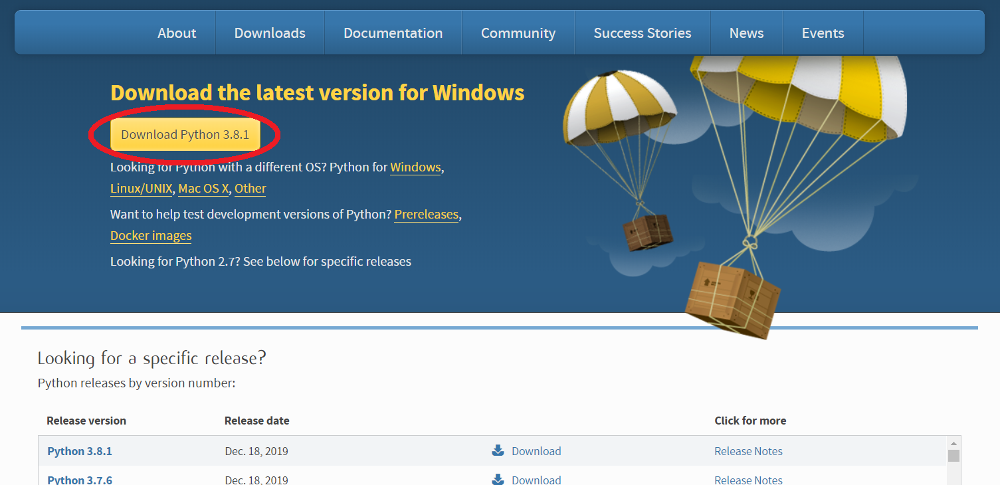
 
Установка стандартная, не требует дополнительных действий. Просто нажимаем далее, если спрашивают. Ничего не меняем
 
* И [Git Bash](https://git-scm.com/download)


Установка стандартная, не требует дополнительных действий. Просто нажимаем далее, если спрашивают. Ничего не меняем

Заходим в папку с клонированным репозиторием в проводнике. Кликаем ПКМ и выбираем Git Bash Here

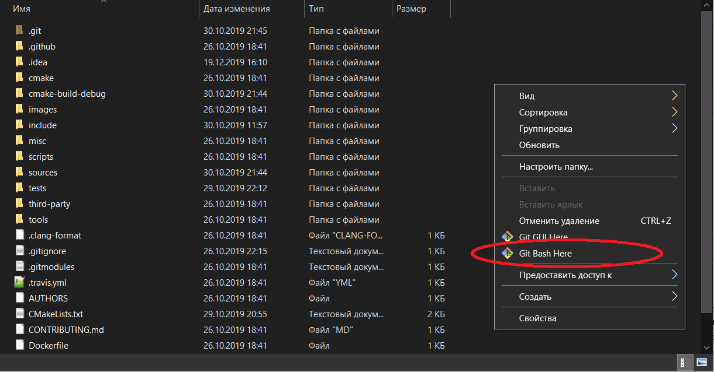

И выполняем эту команду.

```shell script
git submodule update --init
```

#### **Для Linux** (Описано для Debian/Ubuntu и других систем, использующих apt)

```shell script
sudo apt update
sudo apt install git
git clone <ссылка на ваш репозиторий>
```

Где взять ссылку показано на картинке

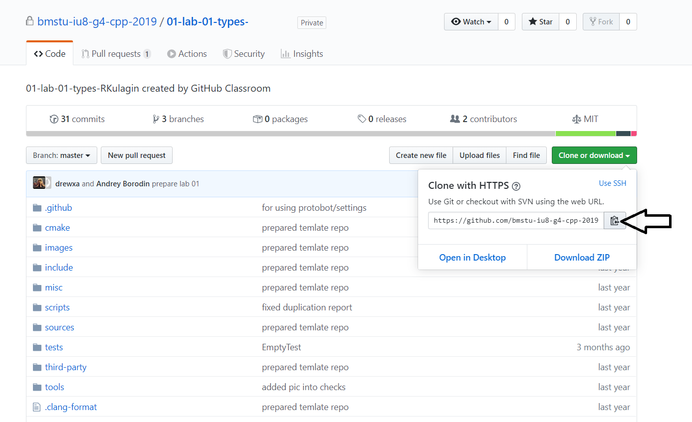

```shell script
cd <название репозитория>
git checkout -b wp/lab
git submodule update --init
```

### Ставим Github Desktop.

Если вы мало знакомы с командами гита, то эта программа с графическим интерфейсом поможет вам на
первом семестре. Чтобы клонировать репозитории и хранить их локально на своей машине, вносить изменения
на удалённый репозиторий и так далее.

* Качаем, устанавливаем [Github Desktop](https://desktop.github.com/)

* Само собой логинимся через учётку github.

* В Github Desktop: `File -> Clone repository` и выбираете нужный Вам репозиторий

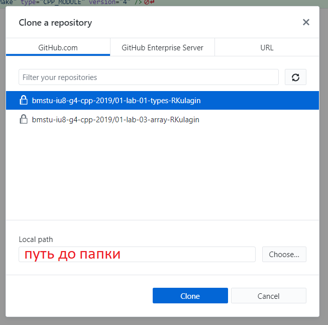

* ветка `master` - эталонная, своего рода шаблон для начала лабы. В неё мы не вносим изменения.
Чтобы начать делать лабу, нам нужно создать свою ветку (обычно её называют `wp/lab`). Сделать это можно, нажав
`New branch` в разделе с ветками. (смотри скрин ниже)

* Изменить ветку на `wp/lab`

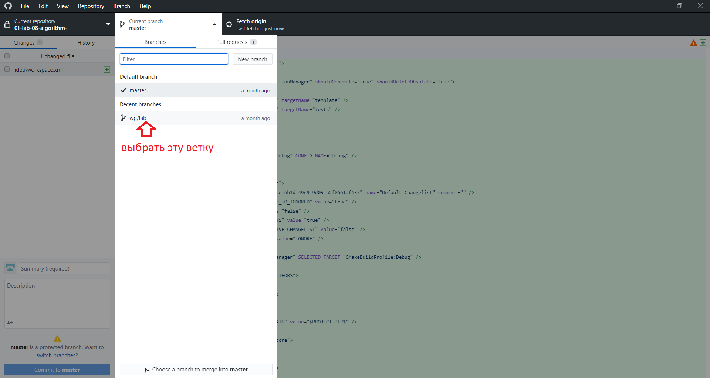

### Начало в CLion

* Запускаем CLion

* Выбираем пункт New CMake Project from Sources или `File -> New CMake Project from Sources`

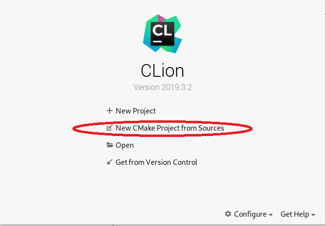

* Выбираем папку с локальным репозиторием (обратите внимание, нужна именно папка, содержащая папку `.git`)

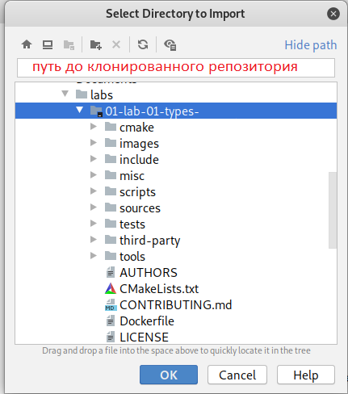

* Важно! Нажимаем Open Existing Project. Иначе CMakeLists.txt перезапишется

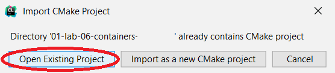

* Готово. Если делаете всё в первый раз на данной машине, то стоит немного подождать, пока Hunter(специальный пакетный менеджер) скачает и установит необходимые зависимости.  

### Начинаем работу c CLion и лабками.

Зачастую лабы суть лаб состоит в том, чтобы вы закодили то, что необходимо по заданию. 
Делается это, как правило в директориях sourses/... - .cpp файлы и include/... - .hpp (подробнее на самих лабах)
Не вдаваясь в подробности, после того как всё сделано, ваш код проходит так называемые unit-тесты. Если интересно их содержание
можно посмотреть тут: /tests/test.cpp В общем и целом они нужны, чтобы подготовленные входные данные автоматически прогонялись через
ваше решения, а выходные данные, в свою очередь, проверялись на правильность. Плохим тоном является выгружать лабу на проверку удалённому
тестировщику TravisCI до того, как вы убедились, что тесты прошли локальную проверку у вас.

Давайте разбёремся, как запускать тестики на вашей машине.

Вот наше окно в CLion с какой-то открытой лабой.

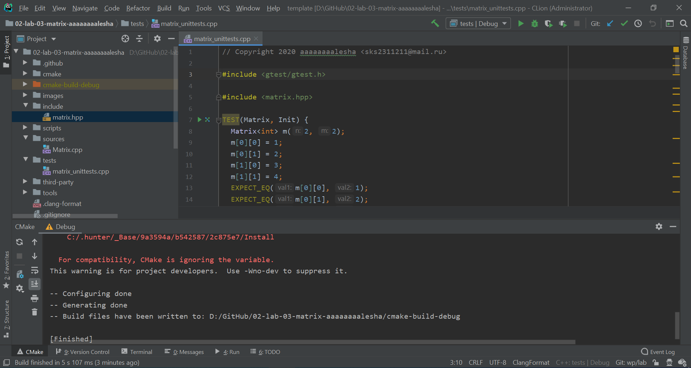

Немного пробежимся по среде разработки.

Слева мы наблюдаем всю файловую иерархию нашего проекта.

Снизу поле для вывода. Туда выводятся всевозможные ошибки CMake, а также там
мы будем видеть, как проходят наши тестики.

Ну по центру место, где будем писать код, с подсветкой синтаксиса, автодополнениями
и другим разработческим сахаром.

Итак, внимание в правый верхний угол. Если сборка вашего проекта прошла успешно (при условии что вы выполнили все пункты выше),
то у вас будет похожая картина.

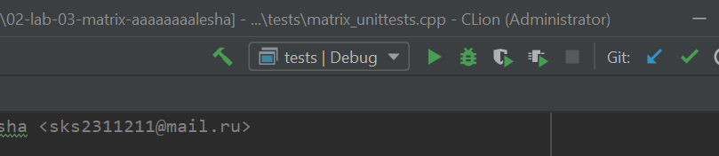

Для того, чтобы запустить тестирование, нажимаем на зелёный треугольничек, и смотрим в окно вывода:

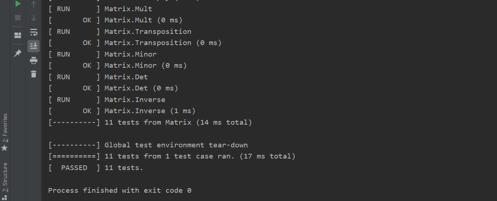

Если вы видете подобное(`RUN   OK` и в конце `[  PASSED  ]`) - у вас всё прекрасно, тестики прошли успешно. 
Однако в большинстве случаев первый вывод больше похож на что-то такое:

```shell script
Running main() from gtest_main.cc
[==========] Running 11 tests from 1 test case.
[----------] Global test environment set-up.
[----------] 11 tests from Matrix
[ RUN      ] Matrix.Init
[       OK ] Matrix.Init (0 ms)
[ RUN      ] Matrix.CopyAssign
[       OK ] Matrix.CopyAssign (0 ms)
[ RUN      ] Matrix.Add
D:\GitHub\02-lab-03-matrix-aaaaaaaalesha\tests\matrix_unittests.cpp:48: Failure
Expected equality of these values:
  s.Rows()
    Which is: 1
  2
[  FAILED  ] Matrix.Add (0 ms)
[ RUN      ] Matrix.AddEmpty
D:\GitHub\02-lab-03-matrix-aaaaaaaalesha\tests\matrix_unittests.cpp:65: Failure
Expected equality of these values:
  s.Rows()
    Which is: 4294967295
  0
[  FAILED  ] Matrix.AddEmpty (0 ms)
[ RUN      ] Matrix.Sub
D:\GitHub\02-lab-03-matrix-aaaaaaaalesha\tests\matrix_unittests.cpp:79: Failure
Expected equality of these values:
  s.Rows()
    Which is: 1
  2
[  FAILED  ] Matrix.Sub (0 ms)
[ RUN      ] Matrix.SubEmpty
D:\GitHub\02-lab-03-matrix-aaaaaaaalesha\tests\matrix_unittests.cpp:94: Failure
Expected equality of these values:
  s.Rows()
    Which is: 4294967295
  0
[  FAILED  ] Matrix.SubEmpty (0 ms)
[ RUN      ] Matrix.Mult
D:\GitHub\02-lab-03-matrix-aaaaaaaalesha\tests\matrix_unittests.cpp:126: Failure
Expected equality of these values:
  s.Rows()
    Which is: 2
  3
[  FAILED  ] Matrix.Mult (0 ms)
[ RUN      ] Matrix.Transposition
[       OK ] Matrix.Transposition (0 ms)
[ RUN      ] Matrix.Minor
[       OK ] Matrix.Minor (0 ms)
[ RUN      ] Matrix.Det
D:\GitHub\02-lab-03-matrix-aaaaaaaalesha\tests\matrix_unittests.cpp:234: Failure
Expected equality of these values:
  n.Det()
    Which is: 0
  343.
    Which is: 343
[  FAILED  ] Matrix.Det (1 ms)
[ RUN      ] Matrix.Inverse
[       OK ] Matrix.Inverse (0 ms)
[----------] 11 tests from Matrix (8 ms total)

[----------] Global test environment tear-down
[==========] 11 tests from 1 test case ran. (9 ms total)
[  PASSED  ] 5 tests.
[  FAILED  ] 6 tests, listed below:
[  FAILED  ] Matrix.Add
[  FAILED  ] Matrix.AddEmpty
[  FAILED  ] Matrix.Sub
[  FAILED  ] Matrix.SubEmpty
[  FAILED  ] Matrix.Mult
[  FAILED  ] Matrix.Det

 6 FAILED TESTS

Process finished with exit code 1
```

Тут тестики пытаются вам намекнуть, какой результат ожидался, а какой был выдан вашей 
программой. Так что попытайтесь отдебажить ваш код - поставить точки остановки на 
строчках, где временно хотите остановить программу и начать идти по ней "по шагам": 

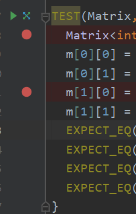

и нажмите на зелёного жучка в той же верхней области (справа от стрелочки).


Видим, что мы вошли в режим дебаггера

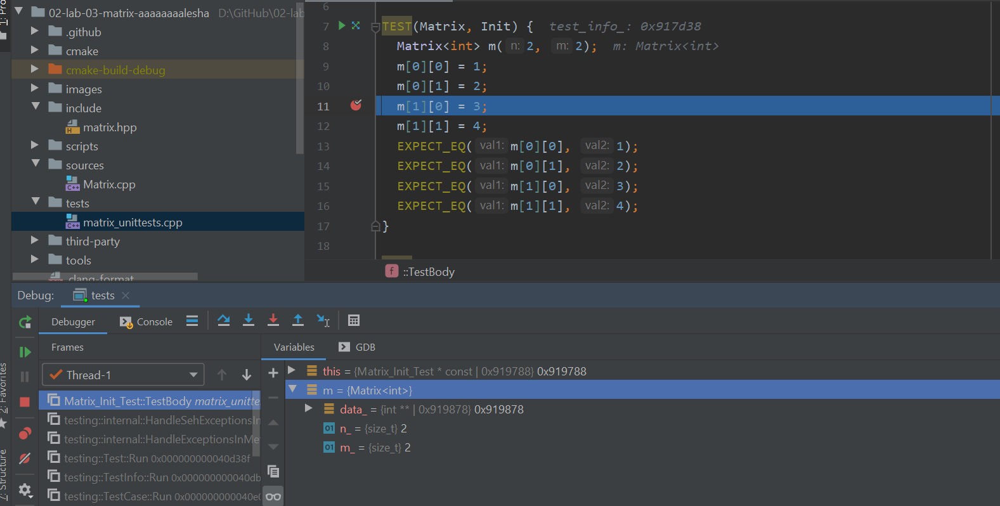

далее можно поиграть с клавишами F8(step over) и F7(step into) - шаг с обходом и шаг
с заходом соответственно. Внизу можем наблюдать локальные и глобалльные переменные и то,
как они изменяются, пока мы шагаем по программе.

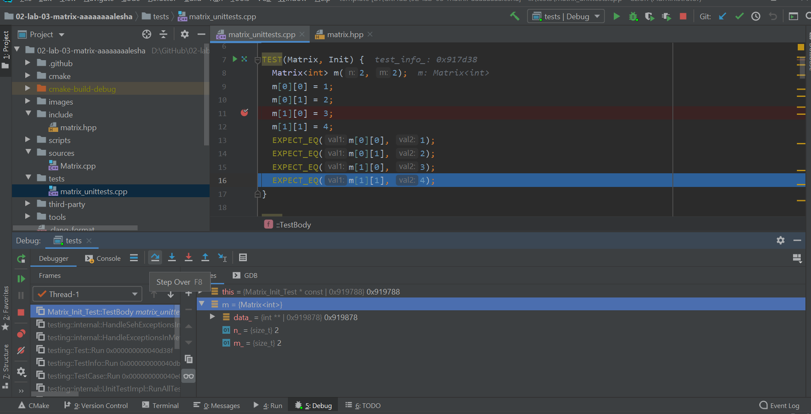

Процесс дебаггинга легко остановить нажатием на красный квадратик в той же верхней правой 
строке.

#### Clang формат. Горячие клавиши.

В нашем ремесле существует специальная утилита clang-format. Она позволяет автоматически форматировать ваш код.
К примеру рассмотрим код до и после применения этой утилиты:

До:
```c++
        #include <iostream>

int  main( ) { std::cout << 


"Hello world!"   << std::endl;

return 0;}
```

Понятно, что такой код читать неприятно, а убирать все пробельчики и табуляции ручками неудобно.

Так что применим нашу утилиту и придадим коду удобоворимый вид:

```c++
#include <iostream>

int main() {
  std::cout << "Hello world!" << std::endl;
  
  return 0;
}

```

Как это настроить:

Окно Clion: `File->Settings->Keymap`

Вводим в окно поиска "Reformat code" и смотрим

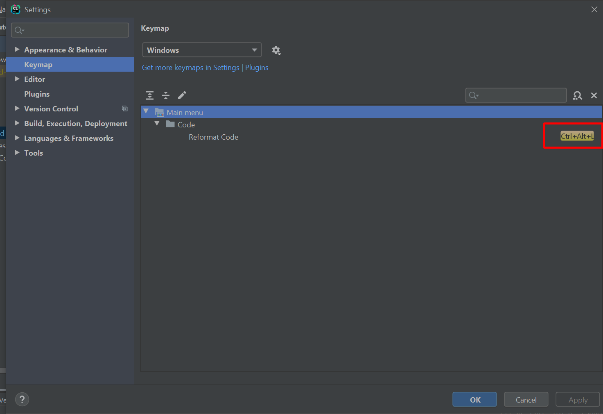
 
Тут настроено сочетание клавиш `Ctrl+Alt+L`. Если у вас такого нет, то настройте и нажмите `Apply`.

После этого вы сможете опробовать утилиту в действии!

### Внесение изменений на удалённый репозиторий (сдача лабы)

Как только все баги пофикшены нужно, чтобы они отправились на удалённый репозиторий.
(чтобы ваши изменения были видны не только вам :D)

Для этого входим в наш уже знакомый Github Desktop и видим, как он подхватил наши изменения:

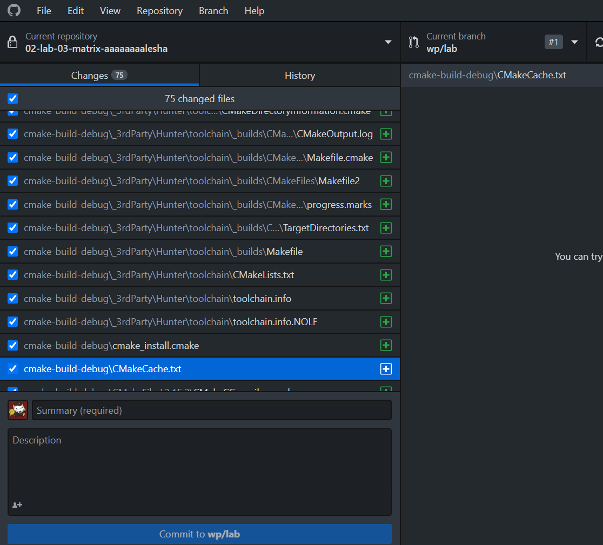

Однако помимо всего прочего в проект вшились `cmake-build-debug` и `.idea`. Там хранится всякая
компиляционная канитель, логи и прочее. Нам это не нужно. Чтобы Github Desktop исключил
этих ребят, нужно открыть файл `.gitignore`(он есть в каждой лабе) и там на любой строчке добавить их в список следующим образом:

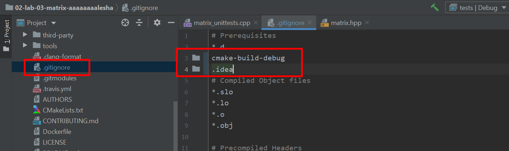

Результат видим следующий: теперь всё ненужное идёт мимо, остались только наши изменения.

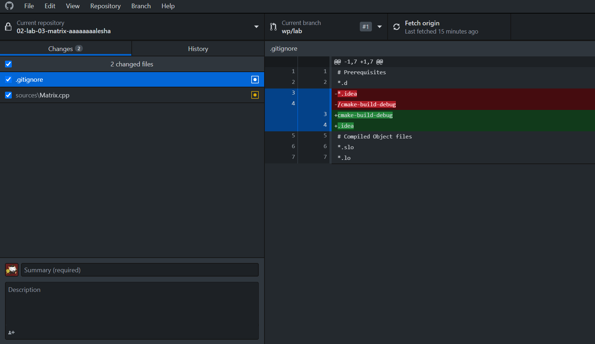

Осталось дать осмысленное описание нашему коммиту и отправить его в полёт на просторы github:

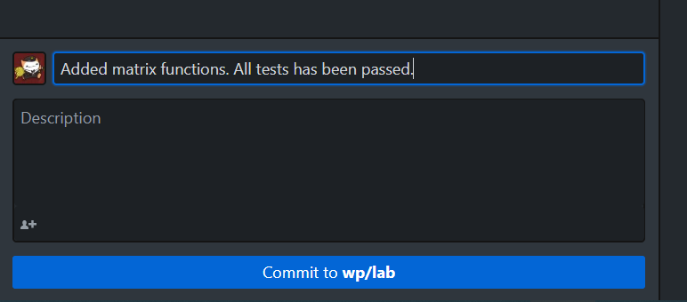
не забудьте нажать на push(внимание: убедитесь что вы делаете это на ветке `wp/lab`)
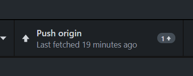

Далее переходим на страницу с лабой в браузере, переключаемся на ветку `wp/lab`:

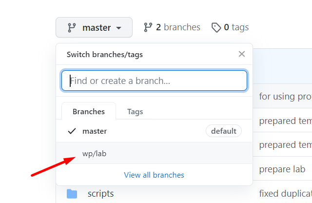

Тут у вас появится подобная рыжая вкладочка с предложением создания pull request'a

(что-то типо такого, картинку в интернетиках нашёл, не бейте)


Нажимаем `Compare & pull request`, даём ему имя `wp/lab` и продолжаем.

Далее вашу лабу начнёт проверять система автоматизированной сборки и проверки тестиков.

Получив у него галочки по всем пунктам можно отсылать ссылку на pull request своему
преподавателю. Дальше он будет вносить свои коррективы в ваш код.

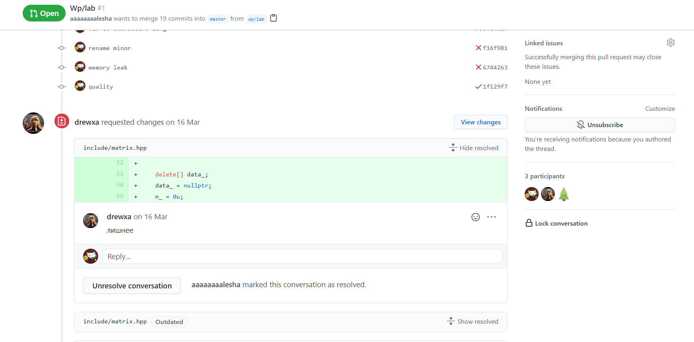

## Заключение

Я попытался написать поподробнее не только про саму работу на Шиндоус, но и общему 
подходу к лабкам в принципе. Не сильно беспокойтесь, что сейчас всё это кажется таким
сложным и муторным. Парочка итераций по алгоритму и вы сами просечёте, в чём фишка и
будете делать это всё на автомате.

Если что, обращайтесь к вашим менторам/волонтёрам/преподавателям. Вам обязательно помогут.
За сим откланиваюсь. Спасибо за внимание.

`Copyright 2020 aaaaaaaalesha & rkulagin`
